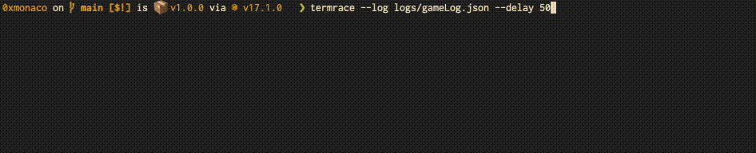

# termrace

Little toy to visualize the 0xmonaco game log with emojis in the terminal.



#### install

```
git clone https://github.com/playmint/0xmonaco-termrace.git
cd 0xmonaco-termrace
npm install -g .
```

#### use

```
termrace --log path/to/logs/gameLog.json --width 100 --delay 100
```


